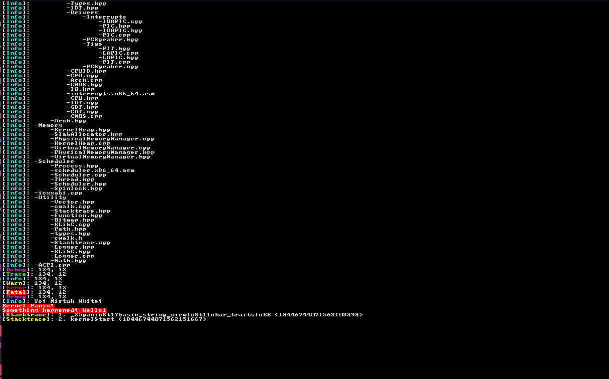

Modern Unix-like Operating System written in C++20


## Supported architectures

- x86-64

## Requirements:

- nasm
- clang
- ld, lld
- meson
- ninja
- xorriso
- qemu

#

## How to build?

First setup meson build directory using

```
meson setup build --cross-file CrossFiles/kernel-target-(x86_64|aarch64).cross-file
```

afterwards build the Kernel

```
./build.sh
``` 

and finally run it in qemu using

```
./run_uefi.sh
```

<br><hr>

## References and Credits

<b>Meson build system<b> - https://mesonbuild.com/
<br>
<b>Limine boot protocol</b> - https://github.com/limine-bootloader/limine/blob/trunk/PROTOCOL.md
<br>
<b> OsDev wiki<b> - https://wiki.osdev.org

### Third Party

<b>- Limine</b>, Modern and lightweight bootloader featuring the limine boot
protocol - https://github.com/limine-bootloader/limine.git
<br>
<b>- fmt</b>, An open-source formatting library providing a fast and safe alternative to C stdio and C++
iostreams - https://github.com/fmtlib/fmt.git
<br>
<b>- parallel-hashmap</b>, A set of excellent hashmap implementations - https://github.com/greg7mdp/parallel-hashmap